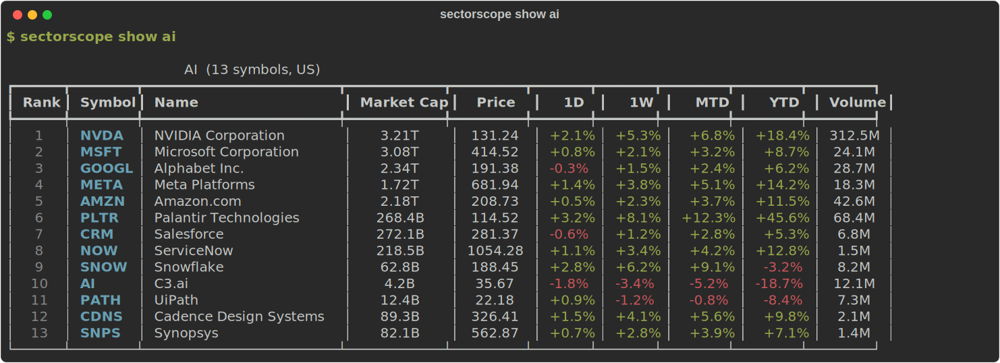

# SectorScope CLI

テーマ・セクター単位で米国株の騰落率を高速確認できるコマンドラインツール。

<picture>
  
</picture>

## 特徴

- **テーマ別の相対強弱** をすぐ把握（防衛、半導体、AI、農業など）
- **36テーマをプリセット** — 伝統的セクターに加え、Crypto / SaaS / AI などニッチなテーマも網羅
- **時価総額順でデフォルト表示**
- **複数出力形式**: テーブル / Markdown / JSON / Vega-Lite
- **ジャンル管理を分離**: 価格は外部ソース、テーマ分類は自前YAML管理
- **カスタムテーマ追加可能** — YAML を置くだけで自分だけのウォッチリストを作成

## インストール

```bash
git clone https://github.com/wataryoichi/sector-scope-cli.git
cd sector-scope-cli
python3 -m venv .venv
source .venv/bin/activate
pip install -e ".[dev]"
```

## クイックスタート

```bash
# ジャンル一覧
sectorscope list-sectors

# 防衛関連をデフォルト表示（時価総額降順）
sectorscope show defense

# 農業関連を年初来順で表示
sectorscope show agriculture --sort ytd

# Markdown テーブル出力
sectorscope show semiconductors --format markdown

# JSON 出力
sectorscope show ai --format json > ai.json

# 表示件数制限
sectorscope show defense --limit 5

# キャッシュ無効
sectorscope show defense --no-cache

# 昇順表示
sectorscope show semiconductors --sort 1d --asc
```

## 出力形式

### table（デフォルト）
Rich ベースの色付きテーブル。ターミナル向け。

### markdown
GitHub / Notion に貼れるテーブル形式。

```bash
sectorscope show defense --format markdown
```

出力例:
```
| Rank | Symbol | Name | Market Cap | Price | 1D | 1W | MTD | YTD | Volume |
|---:|---|---|---:|---:|---:|---:|---:|---:|---:|
| 1 | RTX | RTX Corporation | 164.2B | 132.45 | +1.2% | +4.8% | +5.1% | +12.4% | 5.2M |
```

### json
外部ツール連携用 JSON。

```bash
sectorscope show defense --format json | jq .
```

## ジャンル定義ファイル

`data/universe/us/` 以下にYAML形式で配置。

```yaml
id: defense
label: Defense
market: US
description: US listed defense and defense-adjacent companies
symbols:
  - RTX
  - LMT
  - NOC
  - GD
aliases:
  - military
tags:
  - defense
  - us
metadata:
  updated_at: "2026-03-08"
```

### なぜジャンル管理を分離しているか

Yahoo Finance 等のデータは便利だが、テーマ分類（軍事、農業、AI インフラなど）は安定して一貫提供されるとは限らない。そのため「価格は外部ソースから取得」「ジャンル所属は自前で管理」という構成を採用している。

## カスタムジャンルの追加

`~/.sectorscope/universe/us/` にYAMLファイルを置くと、自分だけのカスタムジャンルを追加できます。

```bash
# カスタムディレクトリを作成
mkdir -p ~/.sectorscope/universe/us

# 自分だけのテーマを追加
cat > ~/.sectorscope/universe/us/space.yaml << 'EOF'
id: space
label: Space
market: US
description: Space exploration and satellite companies
symbols:
  - RKLB
  - ASTS
  - LUNR
  - RDW
  - MNTS
aliases:
  - aerospace
tags:
  - space
  - us
metadata:
  updated_at: "2026-03-08"
EOF

# 追加したジャンルが認識されるか確認
sectorscope list-sectors
sectorscope show space
```

### ジャンル定義の検索優先順

| 優先度 | パス | 用途 |
|:---:|---|---|
| 1 | `~/.sectorscope/universe/` | ユーザーカスタム（最優先） |
| 2 | プロジェクト内 `data/universe/` | 開発用（ソースから実行時） |
| 3 | パッケージ同梱データ | フォールバック（pipx等でインストール時） |

> **注意**: `~/.sectorscope/universe/` にYAMLファイルが1つでも存在すると、そのディレクトリが優先されます。組み込みのセクターも使いたい場合は、パッケージ同梱のYAMLをコピーしてからカスタマイズしてください。

```bash
# 組み込みセクターをコピーしてからカスタマイズする場合
cp -r "$(python3 -c 'import sectorscope; print(sectorscope.__file__)'  | xargs dirname)/data_universe/"* ~/.sectorscope/universe/
```

## universe 管理

```bash
# 定義ファイルの検証
sectorscope universe validate
```

## ソートオプション

| キー | 説明 |
|---|---|
| `market_cap` | 時価総額（デフォルト） |
| `1d` | 前日比 |
| `1w` | 先週比 |
| `mtd` | 月初来 |
| `ytd` | 年初来 |
| `volume` | 出来高 |
| `symbol` | ティッカー |
| `name` | 企業名 |
| `price` | 株価 |

## 利用可能なテーマ一覧

### Sectors — 伝統的セクター (25)

| ID | Label | Symbols |
|---|---|---:|
| `defense` | Defense | 10 |
| `semiconductors` | Semiconductors | 15 |
| `ai` | AI | 13 |
| `agriculture` | Agriculture | 10 |
| `cybersecurity` | Cybersecurity | 10 |
| `nuclear` | Nuclear Energy | 8 |
| `finance` | Finance | 15 |
| `health-technology` | Health Technology | 14 |
| `technology-services` | Technology Services | 14 |
| `energy-minerals` | Energy Minerals | 14 |
| `electronic-technology` | Electronic Technology | 14 |
| `consumer-services` | Consumer Services | 14 |
| `retail-trade` | Retail Trade | 14 |
| `transportation` | Transportation | 14 |
| `utilities` | Utilities | 14 |
| `producer-manufacturing` | Producer Manufacturing | 14 |
| `process-industries` | Process Industries | 14 |
| `consumer-durables` | Consumer Durables | 14 |
| `consumer-non-durables` | Consumer Non-Durables | 14 |
| `commercial-services` | Commercial Services | 14 |
| `communications` | Communications | 12 |
| `health-services` | Health Services | 11 |
| `industrial-services` | Industrial Services | 10 |
| `distribution-services` | Distribution Services | 10 |
| `non-energy-minerals` | Non-Energy Minerals | 14 |

### Themes — Crypto / SaaS / ニッチテーマ (11)

> 定義が変わりやすい新興領域のテーマ。セクターとは別ディレクトリで管理。

| ID | Label | Market | Symbols |
|---|---|---|---:|
| `crypto` | Crypto | US | 12 |
| `bitcoin-miners` | Bitcoin Miners | US | 9 |
| `bitcoin-treasury` | Bitcoin Treasury | US | 7 |
| `ethereum-treasury` | Ethereum Treasury | US | 5 |
| `solana-treasury` | Solana Treasury | MIXED | 5 |
| `stablecoin` | Stablecoin | US | 6 |
| `crypto-payments` | Crypto Payments & Platforms | US | 6 |
| `crypto-japan` | Crypto Japan | JP | 5 |
| `ai-saas` | AI SaaS | US | 6 |
| `security-saas` | Security SaaS | US | 5 |
| `vertical-saas` | Vertical SaaS | US | 4 |

```bash
# Crypto 関連をチェック
sectorscope show crypto
sectorscope show bitcoin-miners --sort ytd

# SaaS テーマ
sectorscope show ai-saas
sectorscope show security-saas
```

## Notes on Yahoo Finance Data

- yfinance は Yahoo Finance の公開 API を使う OSS ライブラリであり、公式 SDK ではありません
- データの一時的な欠損やエラーが発生する可能性があります
- このツールは個人利用を想定しています。取得データの商用利用や大量再配布は Yahoo Finance の利用規約に抵触する可能性があります
- 本ツールの出力は投資助言ではありません。投資判断は自己責任で行ってください。本ツールの利用により生じた損害について、作者は一切の責任を負いません

## 注意事項

- これは投資助言ツールではなく、情報整理ツールです
- テーマ分類には恣意性があります
- 外部ソースのデータ欠損や遅延を前提に設計しています

## 技術スタック

- Python 3.11+
- Typer (CLI)
- Rich (テーブル表示)
- Pydantic (データモデル)
- yfinance (価格取得)
- pandas (集計)

## 将来の計画

- 日本株対応
- 複数ジャンル比較 (`compare`)
- AI 支援によるジャンルメンテナンス
- スクリーニング機能

## ライセンス

MIT
